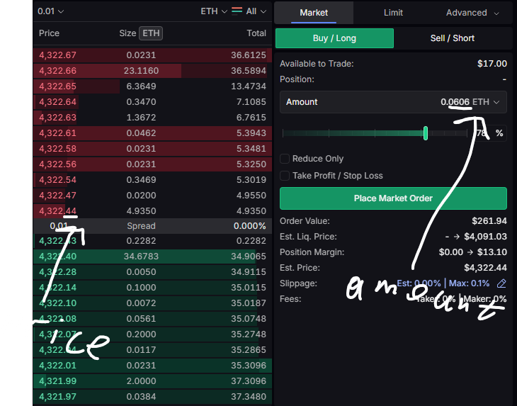

# MM-BID-ASK
Пока супер демо версия, весь нужный функционал есть, всё работает. Но нужно допилить скорость 
(например сейчас много ненужных блокировок потоков), доделать детали и ответственнее следить за сделками.

## Быстрый старт
Для удобства есть докер, который в целом всё качает. Если докер не подходит, то вот требования:

    libcurl, OpenSSL, Boost (system).

## Переменные окружения

- LIGHTER_SIGNER_DLL — путь к библиотеке signer (.so/.dll)
- LIGHTER_API_KEY_PRIVATE — приватный API-ключ (видно при создании)
- LIGHTER_API_KEY_INDEX — индекс API-ключа (int)

- LIGHTER_ACCOUNT_INDEX — индекс аккаунта (int), чтоб получить заходим на https://apidocs.lighter.xyz/reference/accountsbyl1address
и вводим туда адрес подключенного кошелька

Необязательные:
- LIGHTER_BASE_URL — базовый URL (`https://mainnet.zklighter.elliot.ai` по умолчанию можно не ставить)
- LIGHTER_MARKET_INDEX — индекс рынка (string, по умолчанию `13`)

## Price и amount scale
на примере ETH

Сколько знаков после запятой, столько ставим десятков, то есть 10000 - amount и 100 price. 

Либо указать и там и там 1 и писать всё значения целыми числами. не 0.0606, а 606, не тестил так, но вроде должно работать

## Как это работает 

soon так как пока демка
